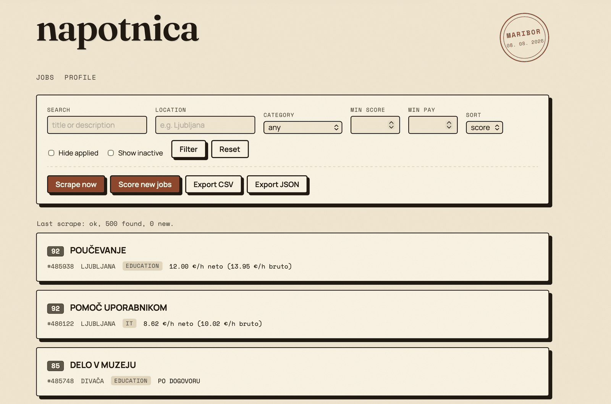
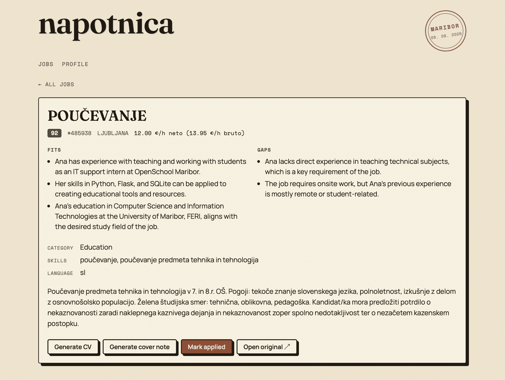

# napotnica

Applying for student work in Slovenia means the same loop every time: open studentski-servis.com, scroll a few hundred ads, find the handful that aren't warehouse night shifts, then rewrite your CV for each one. I got tired of doing that by hand, so I built a local tool that does the collecting and the first pass of the filtering, and drafts a tailored CV and cover note for the listings worth applying to.

It runs entirely on your machine against one SQLite file. Nothing is uploaded anywhere except the job text and your profile, which go to Groq for scoring.

## Screenshots



The job list, sorted by match score. Filters for location, category, minimum score and minimum pay, plus scrape and score triggers that run in the background. Pay is shown net and gross, because student work in Slovenia is quoted both ways and the difference matters when you're comparing two ads.



One listing, with the score broken into what fits and what doesn't. A number on its own tells you nothing you can act on, so the model has to say why. From here you generate the CV and the cover note, or mark the job applied so it drops out of the list.

The interface is deliberately built to look like the paper it replaces. A napotnica is a physical referral slip, so the whole thing is styled as a printed document: three self-hosted typefaces, a date stamp in the corner, and no framework CSS anywhere.

## How it's put together

Flask, SQLite, and server-rendered Jinja templates. Playwright does two jobs: fetching listing pages, and printing the finished CV to PDF. Groq handles the language work.

```
Browser  (Jinja2 · vanilla JS · self-hosted fonts)
   │  HTTP
Flask app
   ├ routes.py    list, filters, job detail, background scrape/score/doc jobs
   ├ scraper.py   Playwright fetch + stdlib HTML parser
   ├ matching.py  extract + score pipeline, profile-hash cache
   ├ cv.py        tailored CV and cover note, with the fact validator
   ├ llm.py       Groq client, JSON-only, pydantic-validated
   ├ export.py    CSV and JSON export of the current filter
   └ repo.py · db.py · schemas.py
   │
SQLite  (data/napotnica.db)
   tables: jobs, blacklist, scrape_runs
```

## The part I actually care about: the CV can't lie

This is the reason the project exists in the form it does. An LLM writing your CV will happily invent a company you never worked at, and you will not notice until an interviewer asks about it.

So the model is allowed to do exactly three things: choose which of your profile entries are relevant to this job, put them in a sensible order, and reword the bullets. It is not allowed to introduce a company, project, school or skill that isn't in `profile.yaml`.

Everything it returns gets checked against the profile before anything is rendered. If it invents something, it gets one retry with the specific violation named. If it does it again, the attempt is aborted rather than written to a document you might send to someone.

The fields that matter most don't go through the model at all. Roles, employer names, years, schools and contact details are rendered straight from `profile.yaml`, so they cannot drift even by accident.

The output is a single A4 page. If the content overflows, the lowest-relevance project gets dropped and it measures again. Type size is never reduced, because a CV that fits by being unreadable hasn't solved anything.

## How scoring works

Two stages, both JSON-only calls validated against a pydantic schema.

**Stage A, extract**: pulls structured metadata out of the ad text. Category, skills mentioned, listing language, and whether it's remote, onsite or unclear.

**Stage B, score**: compares your profile summary against that extract and returns a 0 to 100 score plus two short lists, what fits and what's missing.

Results are cached against a sha256 of `profile.yaml`, so a job is only scored when it's new, when you've edited your profile, or when you force a rescan. Editing one line of your profile rescores everything, which is the correct behaviour but does cost API calls.

A listing that fails to score is marked unscored and the batch continues. One malformed ad shouldn't cost you the other thirty-nine.

## A few decisions worth explaining

**No BeautifulSoup.** The parser is a small DOM built on stdlib `html.parser`. That means every parser test runs offline against saved HTML fixtures with no browser and no network, which is why CI can run the real test suite in a few seconds. Playwright is imported lazily inside `scrape()` so nothing else pays for it.

**No PDF library.** The CV is HTML, printed to PDF through Chromium. Fonts are self-hosted and loaded over `file://` so they actually resolve, and the page waits on `document.fonts.ready` before measuring, otherwise the fit check measures the fallback font and lies to you.

**Two separate retry policies in the LLM client.** A 429 is transient, so it backs off exponentially and tries again. A schema-invalid reply is a different problem, so it gets exactly one retry with the validation error fed back, then raises rather than looping. Retrying a model that misunderstood the schema five times just costs five times as much.

**CSV exports with a BOM.** Excel mangles Slovenian characters without it. Small thing, but the export is useless if you can't open it.

**Scraping is polite.** Only public listing pages, no login, and a random 1.5 to 3 second pause between pages.

## Things I know aren't perfect

- One site only. The parser is coupled to studentski-servis.com's current markup, so a redesign on their end breaks it. The fixtures make that a quick fix rather than a rewrite, but it's still a fix.
- The match score is an LLM's judgement, not a validated metric. Treat it as a sort order, not a verdict.
- Scores skew high and cluster. In the screenshot above a listing scores 92 while its own gaps section says the candidate lacks a key requirement, which means the score isn't weighting stated blockers heavily enough. Useful for ranking, not for deciding.
- Migrations are plain `CREATE TABLE IF NOT EXISTS`. Adding a table is free, changing an existing column is manual.
- No authentication. It's a single-user local tool and it assumes that.
- CV language is Slovenian or English. Anything else needs new section labels.
- Scoring a full scrape costs real Groq calls, capped by `MAX_SCORE_BATCH` (default 40 per run).

## Running it yourself

Python 3.12 or newer.

```bash
git clone https://github.com/PuhmeisterLuka/napotnica.git
cd napotnica
pip install -e ".[dev]"
playwright install chromium

cp .env.example .env          # add your Groq API key
cp profile.example.yaml profile.yaml   # then fill in your own details
```

Run the app:

```bash
flask --app app run
```

Then open http://127.0.0.1:5000. Scraping and scoring both run in the background from buttons in the UI, or from the command line:

```bash
python -m app.scraper     # scrape listings
python -m app.matching    # score whatever is unscored
```

### Environment variables

| Variable | Default | What it does |
|---|---|---|
| `GROQ_API_KEY` | none | Required for scoring and CV generation |
| `GROQ_MODEL` | `llama-3.3-70b-versatile` | Override the model |
| `SCRAPE_BASE_URL` | `https://www.studentski-servis.com` | Listings host |
| `SCRAPE_MAX_PAGES` | `10` | Stop after this many pages |
| `MAX_SCORE_BATCH` | `40` | Cap on jobs scored per run |

`profile.yaml` is the one file you have to fill in properly. Everything the CV generator is allowed to say about you comes from it, so anything missing there simply won't appear.

## Tests

```bash
pytest
```

66 tests, all offline by default. Tests marked `scrape` need a live browser and the real site, and are excluded by the default `addopts`, which is also what CI runs on every push.

- `test_scraper.py` parses saved listing and detail fixtures, including pay strings in the formats the site actually uses.
- `test_matching.py` covers the extract and score pipeline, the profile-hash cache, and a bad listing failing without taking the batch down.
- `test_cv.py` is the biggest one, and most of it is the fact validator: invented companies, invented schools, invented skills, and the retry path.
- `test_llm.py` covers both retry policies separately, backoff on 429 and single-retry on schema failure.
- `test_repo.py` and `test_routes.py` cover queries with filters and the page and endpoint responses.
- `test_export.py` checks the CSV and JSON exports describe identical records.

Run with `-m scrape` if you want the live tests, and expect them to be slow and occasionally fail for reasons that aren't your fault.
